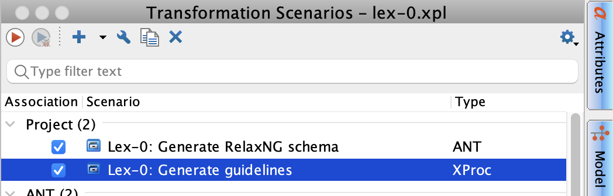

# TEI Lex-0

Repository for the new TEI Lex-0 Schema and Guidelines (test version).

## Getting the code

Clone the repository and enter the working directory:

```sh
git clone https://github.com/ttasovac/tei-lex-0.git
cd tei-lex-0
```

## Repo architecture

- Master ODD lives at `odd/lex-0.odd`, with supporting includes and examples under `odd/includes` and `odd/examples`.
- The XProc script is in `xproc/lex-0.xpl`.
- The stylesheets under `xslt/` are used to generate derived schema and documentation.

### Outputs

All generated artifacts land in `build/` (.gitignored by choice):

- Schemas: `build/rng/` and `build/xsd/`
- HTML docs: `build/html`
- Expanded ODD and intermediates: `build/odd/`

TODO: Add RNG → XSD and RNG → RNC with Trang + maybe compiled ODD from lex-0.xpl.

The HTML documentation expects minified CSS/JS from `assets/`, produced by the npm build step (see below).

Image assets live under `assets/images/` and are copied to `build/html/images/` during `npm run build`. References in `lex-0.odd` and example files use the runtime path `images/...`.

## Build on the command line (CI-friendly)

### Requirements

- Node.js (for asset build scripts).
- XML Calabash (XProc 3.0) to run `xproc/lex-0.xpl`.

### Calabash detection order

`npm run assets:odd` runs `scripts/run-xproc.mjs` and looks for Calabash in this order:

1. `XMLCALABASH_CMD` (shell command string).
2. `xmlcalabash` on `PATH`.
3. `calabash` on `PATH`.
4. `XMLCALABASH_JAR` or `CALABASH_JAR` (full path to the Calabash jar).

### Environment variables

Set one of these before running the pipeline:

- `XMLCALABASH_CMD`: a command string to run XML Calabash on your system
- `XMLCALABASH_JAR` / `CALABASH_JAR`: full path to the Calabash jar file.

For instance:

```sh
XMLCALABASH_CMD=xmlcalabash npm run assets:odd
```

or

```sh
XMLCALABASH_JAR=/path/to/xmlcalabash-app-3.0.35.jar npm run assets:odd
```

### Build steps

- `npm run assets:odd` runs the XProc pipeline to generate the HTML guidelines under `build/html` and the Relax NG schema under `build/html/schema/lex0.rng`.
- `npm run build` runs the full pipeline: HTML guidelines + Relax NG schema (`assets:odd`) + minified CSS/JS (`assets:minify`) + images (`assets:images`).

## Build in oXygen

1. Open `lex-0.xpr` as the project.
2. Run the transformation scenarios:
   - `Lex-0: Generate Relax NG Schema`
   - `Lex-0: Generate guidelines`
3. Install Node dependencies after cloning the repo for the first time with `npm install` in the root folder.
4. Build assets so HTML output has its CSS/JS by running `npm run assets:minify` in the cloned repo root folder.



You can run these transformations regardless of your currently open file. If you want toolbar buttons for even faster access, see the [OxyRuns](https://github.com/BCDH/oxyruns) plugin.
